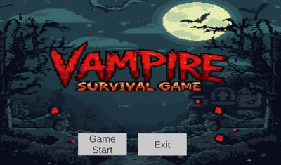

# 2D_VampireSurvivor

> Vampire Survivors 스타일의 자동 공격 기반 로그라이크 게임을 구현한 2D 프로젝트입니다.

프로젝트 목표 :여러 디자인 패턴 구조, 기능을 사용하고, 유지보수와 확장이 용의하도록 설계

프로젝트 기간: 25.11.21 ~ 25.11.27 (7일)

## 엔진 버전 및 라이브러리 목록
- Unity Input System : 키보드 입력을 액션 기반으로 분리하고, 확장 가능한 입력 처리 구조를 구현
- 2D Animation : 캐릭터 상태(Idle/Run/Attack)에 따른 애니메이션 전환 시스템 구현
- Tilemap : 맵을 타일 단위로 구성, Tilemap Collider를 활용해 충돌 영역을 일괄적으로 관리

## Architecture
- **MVP 패턴**: UI와 로직을 분리하여 유지보수 및 테스트 용이성 향상
- **오브젝트 풀링** : 몬스터 생성/ 삭제 시 발생하는 GC성능 최적화
- **옵저버 패턴** : 객체 간 결합도를 낮추고 이벤트 기반으로 상태 변화를 전달
- **상태 패턴** : 플레이어의 상태(이동, 스턴 등)에 따른 행동을 분리하고 관리
- **Behavior Tree (BT)** : 적 AI의 행동을 상황 기반으로 유연하게 제어하기 위해 사용
- **데이터 관리 (JSON / CSV / ScriptableObject)** : 데이터 성격에 따라 저장 방식을 분리하여 저장

## ADR (Architecture Decision Record)
### ADR-001: 데이터 관리 (JSON / CSV / ScriptableObject)
- 상황: 게임 데이터의 성격이 서로 다름(플레이어 진행 데이터, 몬스터/무기 밸런스 데이터 등)
- 결정: 데이터 용도에 따라 저장 방식 분리 
	- JSON -> 플레이어 진행 데이터
	- CSV → 밸런스 조정을 위한 런타임 저장 데이터(무기 능력치)
	- ScriptableObject → 정적 게임 데이터
- 사유
1. JSON : 직렬화/역직렬화를 통해 객체 형태로 데이터 관리가 용이
2. CSV : 테이블 형태로 데이터 수정이 용이하여 밸런싱 작업에 적합
3. ScriptableObject : 런타임 중 변경되지 않는 데이터를 관리

- 개선 방향 : 현재는 데이터 관리 방식이 CSV와 SO(ScriptableObject)로 분리되어있으나, CSV -> SO 변환 자동화를 통해
기획 데이터와 런타임 데이터를 효율적으로 관리하도록 개선할 수 있음

### ADR-002: MVP 패턴
- 상황: UI와 게임 로직이 하나의 클래스에 혼합될 경우, UI 변경 시 로직까지 영향을 받음
- 결정: UI와 로직을 분리하는 MVP 패턴 적용
- 사유
1. UI와 로직을 분리하여 책임을 명확히 해서 변경에 강한 구조
2. MVP vs MVC : MVP는 입력처리를 View에서 받고, 프레젠터가 그 입력을 처리하지만, MVC는 Controller에서 모든 입력 로직 및 처리를 하기때문에 MVP가 결합도가 낮아 MVP채택

### ADR-003: 오브젝트 풀
- 상황: 몬스터와 총알 같은 객체가 게임 내에서 반복적으로 생성 및 제거된다면 GC호출로 인한 성능 문제 발생
- 결정: 객체를 미리 생성해두고 재사용하는 오브젝트 풀링 적용
- 사유: Instantiate/Destroy 호출 시 발생하는 메모리 할당 비용 감소 (GC발생을 줄여 성능 저하)

### ADR-004: 옵저버 패턴
- 상황: 몬스터 사망, 경험치 획득 등 상황에서 객체 간 직접 참조가 많아져 의존성 증가하여 유지보수성 하락
- 결정: C#의 event(Action)을 활용한 옵저버 패턴 적용
- 사유: 이벤트 기반으로 상태 변화를 전달하여 구조를 유연하게 처리하여 신규 기능 추가 시 기존 코드 수정 없이 확장

### ADR-005: 상태 패턴
- 상황: 플레이어가 이동, 스턴 등 상태를 가질때 이후 상태가 추가된다면 로직이 조건문으로 복잡하게 증가
- 결정: 상태별로 행동을 분리하는 상태 패턴 적용
- 사유: 
1. 조건문(switch-case) 기반 상태 처리의 복잡도 증가 방지 및 상태별 로직 분리로 코드 가독성 향상
2. 상태 패턴vs Behavior Tree(BT) :  BT는 복잡한 조건 기반 행동 선택에 적합하지만, 플레이어는 단일 상태 전환 중심의 구조이기에 상태 패턴으로 결정

### ADR-006: Behavior Tree (BT)
- 상황: 적AI가 플레이어 감지, 추적 등 상황에 따라 다른 행동을 수행해야 하며, 조건문 기반으로 구현할 경우 로직이 복잡해지고 확장이 어려움
- 결정: 조건 기반으로 행동을 선택하는 Behavior Tree 적용
- 사유: 조건문 혹은 상태패턴을 사용한다면 조건 하나 마다 행동을 정의하기때문에 분기의 수가 급증하기 때문에 조건에 따른 행동을 트리 구조로 명확하게 표현하는 BT 사용

## 사용 방법
Unity 버전(2022.3.62f3) 사용을 권장드립니다.
Project 폴더의 Assets/Scenes/MainScene 씬을 Play를 하시면 실행이 가능합니다
* 단, 일부 에셋(캐릭터 및 맵 등)의 경우 Unity Asset Store 라이선스 정책에 따라 저장소에 포함되지 않았으며, 
프로젝트 실행을 위해 별도 설치가 필요합니다

